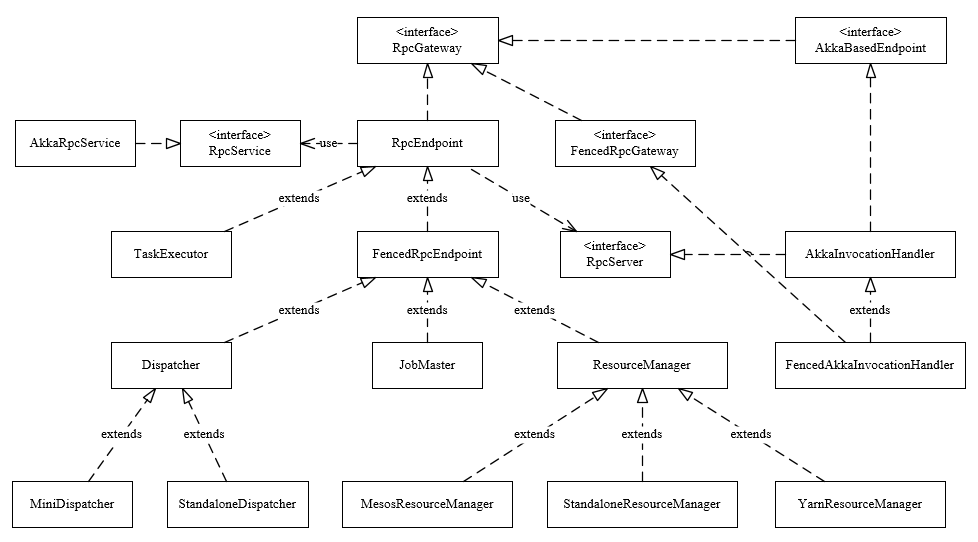

关于Flink RPC主要涉及的类，
这里 [盗图一张](https://www.cnblogs.com/leesf456/p/11120045.html)  


结合书的第16章看   
前提：理解akka和actor模型
知识点：
实现Fencedxxx接口/类的组件是为了防止脑裂，使用了Fenced token机制来验证是不是期望的leader，JobMaster、Dispather、ResourceManager
都是实现了这个Fence token验证机制，也就是继承了FencedRpcEndpoint(继承自RpcEndpoint)。TaskExecutor没有，因为不需要。   

RpcGateway   有getAddress和getHostName方法   
^    
RpcEndpoint(RpcService, endpointId)       
RpcService用来启动停止RpcServer等功能,目前只有AkkaRpcService一个实现（flink底层使用akka，但接口层面的设计看出后续可能会移除）
所有提供rpc功能的组件都继承了RpcEndpoint，我的理解是封装了RpcSercice和RpcServer，从而提供了RPC通信服务，生命周期管理等能力。  
AkkaRpcService的startServer方法：
>* 通过supervisor(也是一个actor对象)创建了具体的AkkaRpcActor，加入到actorref和prcendpoint的映射关系中来(AkkaRpcService的又一个能力)。
>* 通过jdk动态代理构造了RpcServer(它的两个实现类，RpcServer继承了RpcGateway)。   

这里再回到之前讲到的ClusterEntrypoint中的initializeServices方法：
```text
initializeServices {
    AkkaRpcServiceUtils.createRemoteRpcService {
        createAndStart  //这个方法里构建了actorsystem，new了AkkaRpcService
    }
}
```
所以AkkaRpcService持有了actorsystem，这也就是它能够启动RpcServer的原因，它可以获取ActorSystem中的所有ActorRef、address等信息。   
最后一句话概括下RPC的交互：  
在RpcService中调用connect方法和想要交互的RpcEndpoint建立连接，连接成功后根据收到的消息一构造个InvocationHandler后，会调用具体的RpcServer
的invoke方法，发起rpc调用，也就是ask或者tell。  
